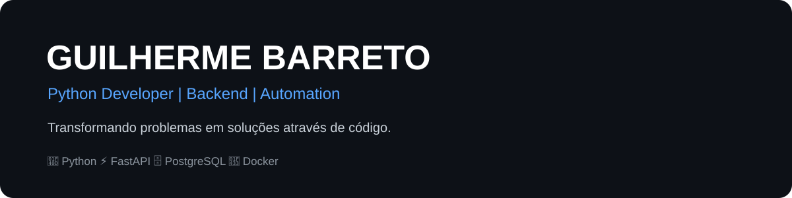

 

## 👨‍💻 Sobre mim

Sou desenvolvedor com foco em Python, desenvolvimento backend e automação, buscando transformar necessidades reais em soluções funcionais, organizadas e escaláveis.

Desenvolvo projetos que utilizam sistema CRUD integrados ao uso de FastAPI, Postgresql e Python. Além de projetos de MachineLearn e DeepLearn, como reconhecimento de expressões Faciais pela Rede neural Convulacional.

Atualmente, meu objetivo é continuar evoluindo como desenvolvedor backend, aprimorando minhas habilidades e construindo projetos que demonstrem minha capacidade de desenvolver soluções completas.

 

## 🛠️ Tecnologias & Ferramentas
### 💻 Desenvolvimento

- Python
- FastAPI
- SQLAlchemy

### 🗄️ Banco de Dados

- PostgreSQL

### 🐳 Infraestrutura & Sistemas
- Docker
- Docker Compose
- Linux
- Debian
- Red Hat Enterprise Linux 8
- Apache
- Git / GitHub

### ⚙️ Automação & Dados
- Pandas
- PyAutoGUI
- Matplotlib

### 🤖 Inteligência Artificial & Machine Learning
- TensorFlow
- Scikit-learn

## 🚀 Projetos

### 🎮 GameBackEND

> API REST desenvolvida em Python para gerenciamento de usuários e jogos, simulando um sistema CRUD e integrando um sistema Python ao Postgresql.

**Tecnologias:**
- Python
- FastAPI
- SQLAlchemy
- PostgreSQL
- Docker
- JavaScript

[🔗 Ver projeto](https://github.com/Salts01/GameBackEND)

---

### 🤖 Reconhecimento de Expressões Faciais

> Projeto de Inteligência Artificial utilizando Redes Neurais Convolucionais (CNN) para reconhecimento de expressões faciais, como Medo, Felicidade, Raiva e Tristeza.

**Tecnologias:**
- Python
- TensorFlow
- Deep Learning
- Redes Neurais Convolucionais
- Tkinter

[🔗 Ver projeto](https://github.com/Salts01/MachineLearn/tree/main/ExpressionIdentification)

---

### 🧠 Machine Learning

> Projetos desenvolvidos durante meus estudos de Machine Learning e Deep Learning, onde é iniciado desde o básico na idenficação de flores com Scikit-Learn, até a identificação de imagens com TensorFlow.

**Tecnologias:**
- Python
- Scikit-learn
- Pandas
- Matplotlib
- TensorFlow

[🔗 Ver projetos](https://github.com/Salts01/MachineLearn)

---

### 🔍 Busca Fácil

> Um projeto feito para ajudar nas buscas de Processos de Jurisprudência, capaz de pesquisar no TRF2, TRF4 e TRF6

**Tecnologias**
- Python
- requests
- threading

[🔗 Ver projeto](https://github.com/Salts01/Busca-F-cil)

## Atualmente 

### Busco Cargos como Desenvolvedor BackEnd Python ou Desenvolvedor de Automatizações

## Contato

[💼 LinkedIn](https://www.linkedin.com/in/guilherme-rodrigues-nogueira-barreto-765826230)

✉️ **gui.rnb@gmail.com** 

[📄 Curriculo](./Curriculo.pdf)

